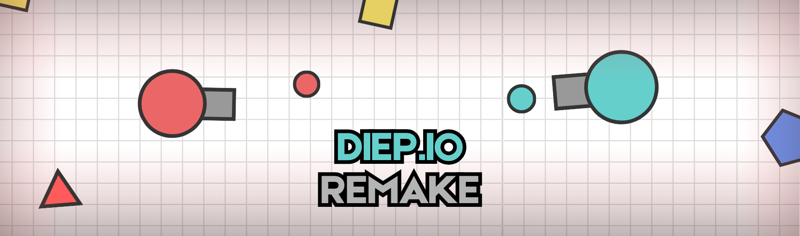

<h1 align="center">Diep Io Remake</h1>
<h3 align="center">

)

> **A remake of the original [Diep Io](diep.io). The game is about tanks which fight against each other using bullets. The tanks can be upgrades by leveling up which is done by breaking polygons.**

</h3>

.

.

### Where to Play?
This is a web based game hosted on GitHub Pages. You can access the game by clicking [here](https://prasadbahekar.github.io/diep-io/) or by opening this link on your browser: https://prasadbahekar.github.io/diep-io.

.

### Programming Languages?
This game is created with Vite and Node.js. The rendering and game engine package used in this project is Phaser.js. It uses the following programming languages:
- **HTML**
- **CSS**
- **JavaScript**
- **JSON**

.

### Features:
The game includes many features which are created in under 31 days. The main highlights are as follows:
- Client and Server distinction
- Automatic Bot Intelligence
- 
