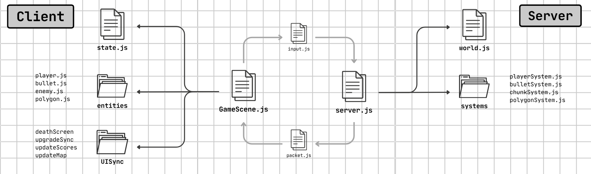

<h1 align="center">Diep Io Remake</h1>
<h3 align="center">

[](https://prasadbahekar.github.io/diep-io/)
[](LICENSE)
[](https://developer.mozilla.org/en-US/docs/Web/JavaScript)


> **A remake of the original [Diep.io](https://diep.io)**. In this, you have to battle as a tank, shoot bullets, destroy polygons, level up, and upgrade your tank!

</h3>

---

## Where to Play?

This is a **web-based game** hosted on **GitHub Pages**. Play instantly—no installation needed!

- **Play Now**: [https://prasadbahekar.github.io/diep-io](https://prasadbahekar.github.io/diep-io)
- Just open the link in any modern browser and start playing!

## Tech Stack Used

The things that I have used to develop this game.

| Category | Technology |
|----------|------------|
| **Build Tool** | [Vite](https://vitejs.dev/) |
| **Runtime** | [Node.js](https://nodejs.org/) |
| **Game Engine** | [Phaser.js](https://phaser.io/) |
| **Languages** | HTML, CSS, JavaScript, JSON |
| **Hosting** | GitHub Pages |

## Features

This prototype is developed **under 31 days**. These are some highlighting features I implemented: 

- **Client-Server Architecture** – Server handles all game logic; clients render and send inputs
- **Smart Bots** – Curated AI that provides challenging single-player gameplay
- **Similar Game** – Deep similarities to the original game (movement, upgrades, physics)
- **Gamepad Support** – Partial controller compatibility.
- **Optimized Code** – Chunk-based rendering for smooth gameplay even with many entities

## How to Play

1. **Move** your tank using WASD or arrow keys
2. **Aim** with your mouse cursor
3. **Shoot** by clicking left mouse button
4. **Destroy** polygons to gain XP and level up
5. **Upgrade** your tank at level-up screens
6. **Compete** against bots to become the strongest!

---

## Behind the Scenes



The code structure follows a **clean upgradable architecture** between the Server and Client:

### Game Loop (10 Steps)
1. **Detect Inputs** (Client) – Capture player movements and actions
2. **Send Inputs to Server** (Client) – Transmit data using the input.js
3. **Update Positions** (Server) – Calculate new positions for players, bullets, polygons
4. **Detect Collisions** (Server) – Checks for entity collisions
5. **Update Health & Score** (Server) – Add damage and update scores
6. **Update Bots** (Server) – Uses the bot intelligence to play
7. **Send Game State** (Server) – Sends data to the client using packet.js
8. **Sync Client Truth** (Client) – Update the state.js to sync with server
9. **Render Everything** (Client) – Draw players, bullets, polygons and locators
10. **Update UI** (Client) – Refresh health bars, level indicators, scores and map

## Run Locally

### Requirements
- Node.js
- npm or yarn

### Setup
```bash
# Clone the repository
git clone https://github.com/prasadbahekar/diep-io.git

# Install dependencies
npm install

# Start development server
npm run dev

# Build for production
npm run build

# Preview production build
npm run preview
```


## Future Plans

This project may get updated in the near future with the following features:

- [ ] **Multiplayer Support** – Real-time player vs player servers
- [ ] **Full Gamepad Support** – Complete controller compatibility
- [ ] **Tank Types Addition** – Ability to upgrade Tanks
- [ ] **Mobile Support** – Touch controls for mobile devices
- [ ] **Sound Effects & Music** – Great audio experience


## License

This project is licensed under the **MIT License** – see the [LICENSE](LICENSE) file for details.

## Credits

- Original game created by **Necrosynth** (Diep.io)
- Game engine: **Phaser.js** community
- Controller Assets from [Kenny](https://kenney.nl/)

---

<div align="center">

**Made with ❤️ by Prasad Bahekar**

Star this repo if you enjoy the game!

</div>
